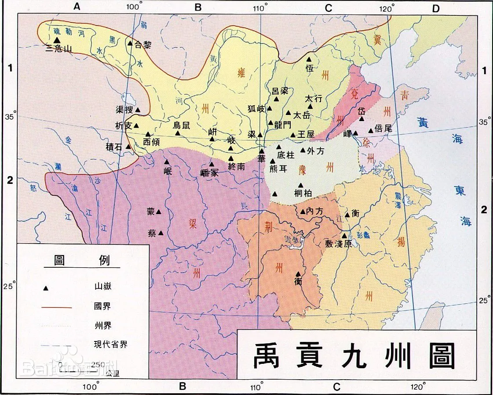

从神话里的盘古劈开混沌世界的那一刻，一个在人们意识里以自我为中心的中央的国家初步确立，这个国家的修缮和补充来自另一个神话里的人物——女娲，她补天造人，使世界充满生机。但最初的国家并不是国家，而为部落，统治权是用一种叫做禅让的方式在部落中相传递。由部落到国家是一个迅疾的过程，具有强大统治欲望的人们追逐着最高权力的同时推进着历史的发展……

——《中国历史导读》第一编导语

<!--more-->

### 炎黄时期

#### 炎帝时期的文明贡献

1. 脱离渔获，创立农耕
2. 创立医药学

阪泉之战：黄帝战胜炎帝

涿鹿之战：黄帝战胜蚩尤，统一中原

#### 黄帝时期的文明贡献

1. 建立氏族联盟，统一中原，为今后的大一统奠定基础
2. 仓颉发明了文字
3. 嫘祖发明了如何养蚕缫丝

```
“男耕女织”是中国传统家庭生活的理想模板
```

1. 创立了历法、算术
2. 创立了音律“宫、商、角、徵、羽”

```
（do，re，mi，so，la）
```

1. 制定了井田制

### 三代时期

尧舜禹：禅让制

大禹治水：三过家门而不入——社会对于中国政治家的基本期望

```
“以国为家、舍家为国”
```

堵不如疏——大禹的治水理念引导中国几千年的黄河治理方案

舜“被迫”流放，禹得“禅让”即位


### 夏朝

大禹将天下分九州



```
冀州：河北平原+山西

兖州：古黄河与济水之间（今山东西部，河南省东北部，河北省东南部）

青州：山东半岛

徐州：淮河平原（今山东南部，江苏北部，安徽北部）

扬州：长江下游（淮河以南，长江流域、岭南地区）

荆州：长江中游（湖南、湖北全境）

雍州：黄土高原、河套平原、河西走廊（陕西北部，宁夏、甘肃全境，内蒙古南部部分）

梁州：巴蜀、汉中、云贵部分（今四川、重庆、陕西南部、云南北部）

豫州：中原地区（河南）
```

#### 夏朝建立

启从父亲大禹那里继承了首领的地位，并建立了华夏第一个王朝夏，确立了中华文明的世袭制度，称夏后启

```
司：父子相继任职的职业

后：将司字翻转过来写，代表地位高贵，指天子
```

#### 后羿篡国及少康中兴

```
		     启死后，太康即位

				   ↓

   司羿篡位，流放太康，立太康子相为傀儡皇帝

				   ↓

	  司羿废相，自立为首领，改称后羿	

				   ↓

    寒浞暗杀后羿，除掉相，篡权自立为首领

				   ↓

    相遗腹子少康，最终除掉寒浞，完成复国
```


#### 夏朝的文明贡献

1. 确立世袭制度，中国正式进入文明时代
2. 制造青铜兵器、青铜礼器
3. 诞生中国第一部历法《夏小正》

### 商朝

#### 商汤建国

商汤任用奴隶出身的伊尹治国，于公元前1650年在上鸣（今山西省安邑县上鸣冈）打败夏桀的军队

在讨伐夏的过程中，商汤自称得到的“**上帝**”的旨意，之后的各朝统治者都用这种神的旨意来解释自己行为的合理性

```
上帝指至高神，上天之帝王，
在明末清初时期，天主教传教士将deus一词翻译为“上帝”，至此在国语语境下的上帝成为西方至高神的代称
```

商汤击败夏桀，建立商朝，完成了华夏历史上第一次正式意义上的改朝换代，也就是所谓“天命的变革”，因此后世将其称为“**革命**”

#### 武丁中兴

由于王族内乱和黄河水灾，商的内部环境十分不稳定

为了改变现状，商王盘庚（商代第二十任君主）决定迁都至殷，为中兴提供基础

武丁（商代第二十一任君主）即位，励精图治，征战周边方国，扩大疆土，掳掠大量奴隶，最终实现中兴

#### 商代的文明贡献

1. 甲骨文
2. 青铜器技术十分成熟。代表作：司母戊鼎、四羊方尊
3. 音律方面，确定了绝对音高和十二律

```
商代使用大量龟甲和兽骨进行占卜，无论打猎、战争、祭祀都要通过占卜来问吉凶

商代大规模的使用人祭，最多一次祭祀使用过2600个奴隶殉葬
```

商代历史是我国有文字记载的最早的历史，商代也是国际历史界普遍认可的中国最早的朝代

### 周朝

#### 周的起源和商纣的灭亡

周文王姬昌掌管西岐吴国（今江苏无锡一带），因其经济和军事实力隐隐威胁到了商帝辛（纣王）的统治，因此姬昌被纣王囚禁在了羑里

```
羑里不仅是华夏历史上的第一座监狱，更是周易文化的发祥地
传说周文王在羑里将伏羲八卦进行推演出六十四卦，并完成《周易》这一历史巨作
```

后来纣王将文王放回西岐，姬昌请来姜子牙作为军事，继续发展力量准备造反，在文王去世后，武王继承父亲的遗志，继续谋划推翻商的阴谋

随后武王姬发会盟诸侯于孟津，最终牧野一战打败了商纣的部队，推翻了商朝统治，开创了周朝

#### 周的建立和传承

周废除了部落联盟制，天下土地接归天子所有，再将土地分封给有功之臣

所谓“普天之下，莫非王土；率土之滨，莫非王臣”

```
分封情况：

大部分：姬姓亲属

少部分：建立功勋的官员，姜子牙封为齐国王

有部分：暂时无法消灭或征服的部落，和血统高贵的部落（如夏朝后人杞侯，尧的后人唐侯，舜的后人陈侯，纣王的儿子武庚封为殷侯）
```

武王死后，其子成王即位，周公旦（姬昌第四子）摄政，后者为奠定中国传统制度的关键人物，

1. 制定了一套典章制度，后世称其为“周礼”
2. 制定了“嫡长子继承制”的宗法制度

成王和其子康王前后执政50年左右，期间中原地区不断发展，史称“成康之治”

成王的弟弟唐叔虞因为其儿戏一言被分封到唐国，即后来的晋国前身

#### 国人暴动

周厉王姬胡，为了填补国家经济亏空，占据大众商品为国有经营，占据山林川泽等生产资料，严重损害了城内贵族和城内平民（统称为“国人”，与奴隶做区分）的利益，引发了普遍的不满。当时的国人在政治上享有自由，并有一定的政治权利

为了镇压民怨，周厉王采取名为“卫巫”的特务机构，对有怨言的国人采取暴力镇压的手段。最终在公元前841年，“国人”领导发动暴动，使得周厉王被迫出逃

贵族们推举召公和周公共同摄政，重要政治决策由六卿共同商议，第一次产生了贵族政权的集体共治的中央政府，这种政体在后世被称为“共和”

14年后，逃亡的周厉王病故，周宣王即位，短暂的共和制政治结束，重新恢复君主制

但在国人暴动之后，君主制流于形式，国家统一的力量越来越薄弱

#### 西周的灭亡和诸侯的混战

宣王死后其子周幽王即位，为了博取其妃褒姒一笑，搞出了“烽火戏诸侯”的荒唐事，并最终在犬戎真的攻打过来时，由于周边属国军队支援不及时导致国都镐京遭破

申国公和其他诸侯立他的外孙姬宜臼为平王，并迁都至成周（原洛邑），至此西周灭亡

```
晋文侯帮助将平王周边的臣子消灭，郑武公主持平王迁都事宜，最初的周天子权力就落到了这两国手中

郑国用计吞并了邻近的胡国，从此各分封地诸侯开始了持续几百年的互相征伐
```

#### 周朝的文明贡献

1. 熟练使用青铜器农具，并开始掌握冶铁技术，开始有铁农具出现
2. 普遍使用金文

#### 
